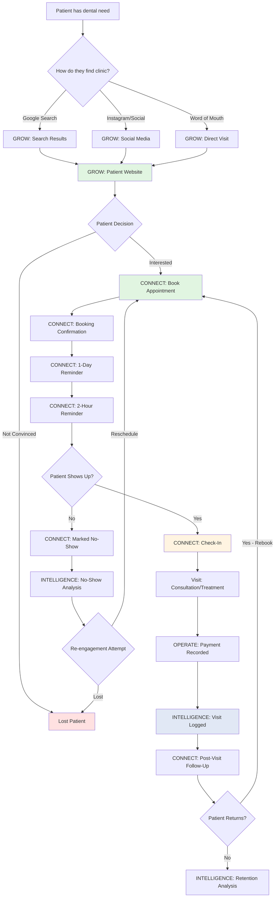

# Patient Journey Map — End-to-End Digital Experience

> **Phase 2.2 Deliverable**
> Visual map of patient journey across all 4 modules, annotated with interview insights.

---

## Journey Overview



---

## Detailed Journey Stages

### Stage 1: DISCOVERY (GROW Module)

**Patient Need:** Toothache, routine cleaning, or cosmetic treatment

**Discovery Channels (from Patient interview):**
1. **Google Search** (70%) — "dokter gigi Kelapa Gading"
2. **Google Maps** (embedded in search results)
3. **Instagram** (20%) — clinic posts, patient tags
4. **Word of Mouth** (10%) — friend/family referral

**Patient Actions:**
1. Searches on phone while at work/home
2. Scans Google Maps results — distance, reviews, photos
3. Clicks top 3 results → opens websites
4. Looks for:
   - Doctor credentials (interview: "I prefer experienced doctors")
   - Price indication (interview: "Couldn't find price on website, had to call")
   - Location/parking (interview: "Parking is important")
   - Insurance acceptance (interview: "I wanted to know which insurance partners")

**GROW Delivers:**
- SEO-optimized website ranks in top 3 for "dokter gigi [area]"
- Doctor profile pages show credentials, experience, photo
- Service pages show price range ("Starting from IDR 200K") — optional
- Location pages show address, parking info, Google Maps embed
- Insurance partner logos on homepage
- Mobile-responsive (patient searches on phone)

**Conversion Event:** Patient clicks "Buat Janji" (Make Appointment) button

**Drop-off Risk:**
- Website doesn't load fast (slow internet) → lost
- No price indication → patient calls competitor instead
- No parking info → patient assumes no parking, chooses another clinic
- No online booking → patient must call during office hours (friction)

**Interview Insight:**
> "I visited the website — it's very basic. Just address, phone number, a few photos. No doctor profiles, no price list, no online booking. I had to call." — Patient

**GROW solves this:** Comprehensive website with all info patient needs + online booking widget.

---

### Stage 2: BOOKING (CONNECT Module)

**Patient Action:** Clicks "Buat Janji" button on website

**Booking Flow (5 steps, <2 minutes):**

1. **Select Branch** (distance-sorted, shows nearest first)
   - Patient sees: Kelapa Gading (2.3 km), Pluit (5.1 km), BSD (8.7 km)
   - Interview insight: "Location must be close to home or office"

2. **Select Doctor** (or "Any Doctor — Fastest Available")
   - Shows photo, specialty, available days
   - Interview insight: "40% of patients ask for specific doctor"

3. **Select Date & Time**
   - Calendar shows only available slots (no double-booking)
   - Real-time availability check
   - If preferred branch full → "Coba cabang lain?" button suggests alternative branches
   - Interview insight (Director): "Branch A full, Branch B empty 5 km away, patient goes to competitor"

4. **Patient Info**
   - Name, phone (WA number), email (optional), reason for visit, insurance
   - Consent checkbox (UU PDP compliance)
   - Interview insight (Patient): "Make it like Halodoc — easy"

5. **Confirmation**
   - Instant booking (no manual confirmation wait)
   - Booking code displayed
   - WA confirmation sent within 30 seconds
   - Add to calendar button
   - Interview insight (Patient): "I hate waiting 12 hours for WhatsApp reply"

**CONNECT Delivers:**
- Real-time slot availability (prevents double-booking)
- Multi-branch search (captures patients who would otherwise go to competitor)
- Anonymous booking (no account required — low friction)
- Instant confirmation (no receptionist bottleneck)

**Conversion Event:** Booking confirmed → appointment created in system

**Drop-off Risk:**
- No available slots in next 7 days → patient books elsewhere
- Form too long → patient abandons
- No immediate confirmation → patient doubts booking went through
- No WA confirmation → patient forgets appointment

**Interview Insight:**
> "If I could book online as easily as ordering food, I'd prefer that. I hate calling during office hours." — Patient

**CONNECT solves this:** Booking takes <2 minutes, confirmation instant, no phone call needed.

---

### Stage 3: PRE-VISIT REMINDERS (CONNECT Module)

**Timeline:**
- **T-24 hours:** 1-day reminder sent via WA
- **T-2 hours:** 2-hour reminder sent via WA

**WA Message Content:**
```
Halo [Patient Name],

Pengingat: Anda memiliki janji dengan dr. Andi Pratama besok, 
Rabu 10 September 2026 pukul 14:00 di Klinik Kelapa Gading.

Alamat: Jl. Boulevard Raya No. 123

Jika tidak bisa hadir, silakan batalkan via link ini:
[Cancel Link]

Terima kasih!
Klinik Gigi Senyum Sehat
```

**Patient Actions:**
1. Receives reminder → checks calendar
2. If conflict → clicks cancel link, reschedules for another day
3. If OK → mentally prepares to attend

**MVP Implementation (wa.me):**
- Receptionist sees "Reminders to Send" list in portal
- Clicks "Send Reminder" → WA Web opens with pre-filled message
- Receptionist hits Send (manual last step)
- **Phase 2 upgrade:** WA Business API sends automatically (no manual step)

**Interview Insight:**
> "If they sent another reminder 2 hours before, that would have helped. I booked 2 weeks in advance, got 1-day reminder, but on the actual day I forgot." — Patient

**CONNECT solves this:** 2-hour reminder added (not just 1-day).

**Drop-off Risk:**
- Patient doesn't receive reminder (wrong WA number) → no-show
- Patient receives reminder but forgets by appointment time → no-show
- Patient wants to cancel but link is broken → no-show (clinic loses revenue opportunity)

**No-Show Baseline (from interviews):** 20-30% on Mondays, 10-15% other days

**Expected Improvement:** 2-hour reminder reduces no-show rate to <15% (hypothesis to validate post-launch)

---

### Stage 4: CHECK-IN (CONNECT Module)

**Patient Action:** Arrives at clinic, approaches reception

**Receptionist Flow:**
1. Opens portal: `/portal/appointments/today`
2. Sees list of today's appointments (filtered by branch)
3. Patient says name → receptionist searches (instant filter)
4. Clicks "Check In" button
5. Status changes: `CONFIRMED` → `CHECKED_IN`
6. Timestamp recorded
7. Receptionist tells patient: "Silakan tunggu, dokter akan memanggil Anda"

**Alternative (Walk-In):**
- Patient has no booking → receptionist clicks "New Appointment"
- Fills in patient name + phone → selects doctor + time → creates appointment with status `WALK_IN`
- Same check-in flow

**CONNECT Delivers:**
- One-click check-in (replaces paper list crossing-off)
- Real-time status updates (if second receptionist checks in same patient, first receptionist sees it)
- Search by name or phone (handles partial matches)

**Interview Insight:**
> "When patient arrives, I ask their name, find them on the printed list, cross off. Sometimes the list is messy or I can't read the handwriting." — Receptionist

**CONNECT solves this:** Digital list, searchable, always legible.

**Drop-off Risk:**
- Receptionist forgets to mark check-in → analytics show patient as no-show (data integrity issue)
- Patient checked in but waits 30+ minutes → complaints, negative review

---

### Stage 5: VISIT (OPERATE + INTELLIGENCE Modules)

**Doctor Workflow (Phase 2 INTELLIGENCE — basic):**
1. Doctor calls patient from waiting area
2. Patient enters treatment room
3. Doctor searches patient name in portal → sees visit history
   - Previous visits: dates, services performed, which doctor
   - **Phase 2:** No clinical notes (paper files still used)
   - **Phase 3 EMR:** Full clinical notes, X-rays, treatment plan visible
4. Doctor performs consultation/treatment
5. Doctor marks appointment as `COMPLETED` (optional in Phase 2)

**Payment (OPERATE Module — if enabled in Phase 2):**
- Receptionist records payment amount
- Payment method: cash, transfer, credit card, insurance
- Invoice generated (optional — simple receipt)

**INTELLIGENCE Logging:**
- Visit recorded in system
- Data captured: patient, doctor, service, date, payment amount
- This data feeds analytics dashboard (Director sees +1 completed appointment)

**Interview Insight (Doctor):**
> "I want to see patient's previous visit history. Right now paper files only. If patient went to different branch last time, I don't have that file." — Doctor

**INTELLIGENCE solves this (Phase 2):** Cross-branch visit history visible to all doctors in same organization.

**Phase 3 EMR:** Doctor enters clinical notes during visit, saves to system, no paper needed.

---

### Stage 6: POST-VISIT (CONNECT Module — Phase 2+)

**Retention Flow:**

**T+1 day:** Post-visit thank you (optional)
```
Terima kasih sudah berkunjung ke Klinik Gigi Senyum Sehat!

Kami harap perawatan Anda berjalan lancar. 
Jika ada keluhan, hubungi kami via WhatsApp.

[Rate Your Experience] (Phase 3+)
```

**T+6 months:** Routine check-up reminder (Phase 3+)
```
Halo [Patient Name],

Sudah 6 bulan sejak kunjungan terakhir Anda untuk Cleaning.
Saatnya check-up rutin!

Buat janji sekarang: [Booking Link]
```

**MVP (Phase 2):** Manual post-visit follow-up (receptionist sends thank you message via WA). Automated follow-up = Phase 3+.

**Interview Insight:**
> "I've been going to this clinic for 3 years. They never remind me when it's time for my next cleaning. I have to remember myself." — Patient

**Phase 3 solves this:** Automated 6-month reminder for routine check-ups (increases retention, recurring revenue).

---

### Stage 7: RETENTION ANALYSIS (INTELLIGENCE Module)

**Director Dashboard View:**

**Patient Retention Metrics (Phase 3+):**
- **First-time patients:** 120 this month
- **Returning patients:** 80 this month (40% return rate)
- **Churn risk:** 50 patients haven't returned in 12+ months
- **Average time between visits:** 6.2 months

**Top Reasons for Return (Phase 3+ — survey data):**
1. Reminder received (60%)
2. Trust in doctor (30%)
3. Convenient location (10%)

**Re-engagement Campaign (Phase 3+):**
- Director sees "50 patients at risk of churn"
- Clicks "Send Re-engagement Campaign"
- System sends WA: "Kami kangen Anda! Diskon 20% untuk kunjungan berikutnya."

**Interview Insight (Director):**
> "I don't know which patients are about to churn. I only find out they stopped coming when I notice revenue is down." — Director (implied from pain points)

**INTELLIGENCE solves this (Phase 3):** Proactive churn prediction and re-engagement automation.

---

## Journey Success Metrics

| Stage | Metric | Baseline (Manual) | Target (Think Edge) |
|---|---|---|---|
| **Discovery → Booking** | Conversion rate | ~5% (call during office hours) | 15%+ (online booking available 24/7) |
| **Booking → Check-In** | No-show rate | 20-30% | <15% (with 2-hour reminder) |
| **Check-In → Completed** | Visit completion | 100% (rarely cancel after check-in) | 100% |
| **First Visit → Return** | Retention rate (6 months) | Unknown (no tracking) | 40%+ (Phase 3 target with automated reminders) |

---

## Pain Points Solved by Journey

| Pain Point | Interview Source | Module | Solution |
|---|---|---|---|
| "Can't find price or doctor info on website" | Patient | GROW | Comprehensive website with doctor profiles, service pricing |
| "Have to wait 12 hours for WA booking confirmation" | Patient | CONNECT | Instant online booking, real-time confirmation |
| "Branch A full, patient goes to competitor" | Director | CONNECT | Multi-branch search suggests alternative nearby branches |
| "Double-booking happens 3x/month" | Receptionist | CONNECT | Real-time availability check prevents double-booking |
| "Patient books 2 weeks in advance, forgets" | Patient | CONNECT | 1-day + 2-hour reminders reduce no-shows |
| "I spend 3-4 hours/day handling booking messages" | Receptionist | CONNECT | Online booking cuts receptionist workload by 50% |
| "I don't have patient's previous visit history if they went to another branch" | Doctor | INTELLIGENCE | Cross-branch visit history visible to all doctors |
| "I spend 1-2 hours/week collecting data from all branches" | Director | INTELLIGENCE | Real-time dashboard consolidates all branches |

---

## Journey Drop-Off Points (Where Patients Are Lost)

```
100 patients Google search "dokter gigi Kelapa Gading"
  ↓ (70% click top 3 results)
 70 visit clinic website
  ↓ (50% interested, 50% not convinced)
 35 click "Buat Janji"
  ↓ (80% complete booking, 20% drop off — form too long, no available slots)
 28 bookings confirmed
  ↓ (15% no-show despite reminders)
 24 patients check in
  ↓ (100% complete visit after check-in)
 24 completed visits
  ↓ (40% return within 6 months — Phase 3 target)
 10 returning patients (recurring revenue)
```

**Think Edge Impact:**
- **Discovery → Booking:** +10% conversion (better website, online booking available)
- **Booking → Check-In:** -10% no-show rate (2-hour reminder)
- **Visit → Return:** +10% retention (Phase 3 automated 6-month reminder)

**Revenue Impact Example (hypothetical):**
- Before: 100 searches → 24 completed visits → 10 returns = 34 total visits
- After: 100 searches → 35 bookings → 30 check-ins → 12 returns = 42 total visits
- **+23% more patients treated** from same search traffic

---

## Next: Lock MVP Scope

Journey map shows how modules connect. Now lock exactly what ships in MVP (Sprint 1-2).
